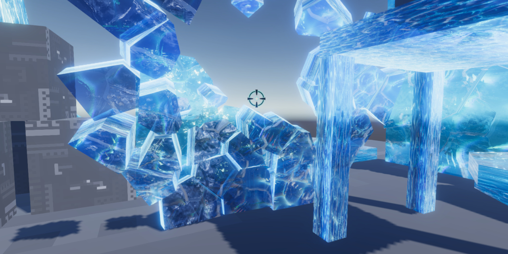

# Simple Voronoi Fragmenter

## What is This ?
Runtime destructive script assets that work with Unity WebGL builds.   
Unity WebGL ビルドで動くランタイム破壊スクリプトアセットです  
[Demo(WebGL)](https://d1nl077dbzu98o.cloudfront.net/CubeFragment0320/index.html)

## How to Play

1. After git clone, open as a Unity 2021.3.21f1 or later Universal RP project.
2. Open "Assets/SimplestarGame/VoronoiFragmenter/Scenes/SampleScene.unity" file and play it.
3. Press W key to move camera forward, S key to move camera backward, A, D keys to slide camera horizontally, Q, E keys to elevate camera up and down.
4. Hold down the right mouse button and drag the mouse to rotate the camera.
5. A left mouse click destroys the object that was targeted by the reticle.
6. Pressing the Reset button in the upper right corner resets the scene to its initial state.

## Technical Information

- The core process is the VoronoiFragmenter script component. Please read the content carefully to understand and use it.
- Voronoi diagram division is using [csDelaunay](https://github.com/PouletFrit/csDelaunay).

## Terms of Use  
- Use is free and no reporting is required.
- If you use Twitter, use the hashtag #SimpleVoronoiFragmenter and I will spread the post if I find it.
